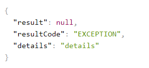

### DOCUMENTATION API
url| application       
-------------------------------------------|------------|
http://localhost:8080/swagger-ui/index.html| GATEWAY
http://localhost:8081/swagger-ui/index.html#| RETAILMENT
http://localhost:8082/swagger-ui/index.html#| ORDER
http://localhost:5000/swagger-ui/index.html#| ADMIN

FIGMA
https://www.figma.com/file/SKXegz852N92PZ7eOfKjaV/VOLUMENZEIT-~16000-19000

Моделька в ответе роута

как видно на картинке resultCode 2 типа
- EXCEPTION
- SUCCESS